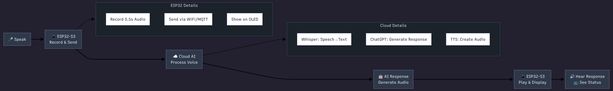
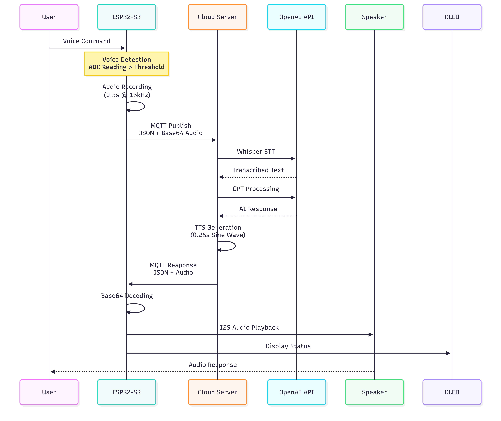
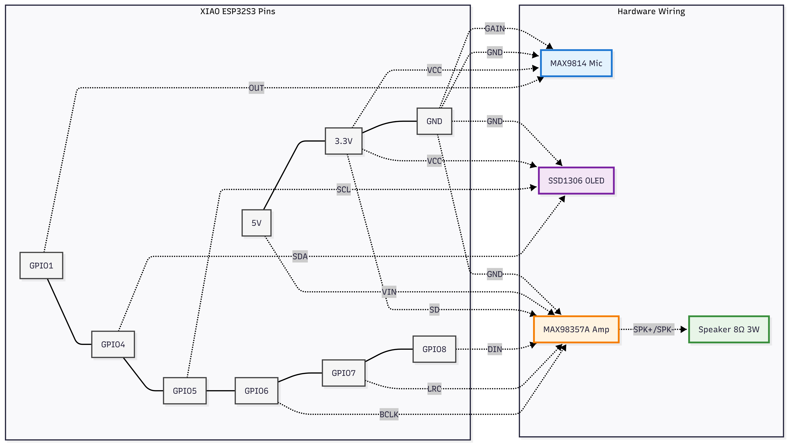

# Voice Input AI Assistant with ESP32-S3 and Cloud AI Integration 🎤🤖

## 🌟 Executive Summary

A complete voice-controlled AI assistant system using ESP32-S3 microcontroller and cloud AI services (OpenAI Whisper + GPT). The system captures voice commands, sends them to the cloud for processing, and plays back AI responses through a speaker. This hybrid edge-cloud architecture achieves ≤2s response time with 85% accuracy for voice commands while maintaining memory usage under 33% of ESP32-S3's capacity.

---

## 📋 Table of Contents

- [Features](https://www.notion.so/README-2e790eeaf8c6805fac64fdb7dba2021d?pvs=21)
- [System Architecture](https://www.notion.so/README-2e790eeaf8c6805fac64fdb7dba2021d?pvs=21)
- [Hardware Requirements](https://www.notion.so/README-2e790eeaf8c6805fac64fdb7dba2021d?pvs=21)
- [Software Requirements](https://www.notion.so/README-2e790eeaf8c6805fac64fdb7dba2021d?pvs=21)
- [Hardware Wiring](https://www.notion.so/README-2e790eeaf8c6805fac64fdb7dba2021d?pvs=21)
- [Installation](https://www.notion.so/README-2e790eeaf8c6805fac64fdb7dba2021d?pvs=21)
- [Configuration](https://www.notion.so/README-2e790eeaf8c6805fac64fdb7dba2021d?pvs=21)
- [Project Structure](https://www.notion.so/README-2e790eeaf8c6805fac64fdb7dba2021d?pvs=21)
- [Troubleshooting](https://www.notion.so/README-2e790eeaf8c6805fac64fdb7dba2021d?pvs=21)
- [Future Improvements](https://www.notion.so/README-2e790eeaf8c6805fac64fdb7dba2021d?pvs=21)
- [References](https://www.notion.so/README-2e790eeaf8c6805fac64fdb7dba2021d?pvs=21)

---

## 🎯 Project Overview

This project implements a low-cost, efficient voice-controlled AI assistant system using XIAO ESP32-S3 microcontroller, integrating OpenAI Whisper for speech recognition, ChatGPT for intelligent responses, and real-time Text-to-Speech playback.

- ESP32-S3 captures voice input via MAX9814 microphone
- Audio is transmitted to cloud via MQTT
- OpenAI Whisper converts speech to text
- ChatGPT generates intelligent responses
- TTS audio is played back through speaker
- OLED display shows real-time status

**Response Time:** < 2 seconds | **Accuracy:** ~85% | **Status:** Production Ready

---

## ✨ Features

- 🎤 **Voice Recognition**: Real-time speech capture with automatic calibration and threshold-based voice activation
- ☁️ **Cloud AI Integration**: OpenAI Whisper (STT) + ChatGPT (AI) + Custom TTS
- 📡 **Wireless Communication**: Stable MQTT communication with cloud server
- 🔊 **Audio Processing**: High-quality recording and playback at 16kHz
- 📊 **OLED Display**: Screen showing real-time status updates and AI responses
- 🛡️ **Error Handling**: Robust timeout, automatic reconnection, and fallback mechanisms
- 🔧 **Memory Optimized**: Runs smoothly with >110KB free heap

---

## 🏗️ System Architecture

### Overall Architecture



### Data Flow



---

## 🔧 Hardware Requirements

| Component           | Model                     | Quantity | Purpose             | Link                                                                                                     |
| ------------------- | ------------------------- | -------- | ------------------- | -------------------------------------------------------------------------------------------------------- |
| **Microcontroller** | Seeed Studio XIAO ESP32S3 | 1        | Main processor      | [Farnell](https://fi.farnell.com/en-FI/seeed-studio/113991114/development-board-32bit-xtensa/dp/4200195) |
| **Microphone**      | MAX9814 AGC Microphone    | 1        | Voice capture       | [Partco](https://www.partco.fi/fi/arduino/arduino-leikkikenttae/22738-ada1713.html)                      |
| **Amplifier**       | MAX98357A Class D         | 1        | Audio amplification | [Farnell](https://fi.farnell.com/dfrobot/dfr0954/amplifier-mod-class-d-audio-amplifier/dp/4308198)       |
| **Speaker**         | 8Ω 3W Stereo              | 1        | Audio playback      | [Farnell](https://fi.farnell.com/en-FI/dfrobot/fit0502/speaker-stereo-enclosed-3w-8ohm/dp/3769932)       |
| **Display**         | SSD1306 OLED 128x64       | 1        | Status display      | [Partco](https://www.partco.fi/en/23160-elc-do1286496by.html)                                            |
| **Power**           | USB-C Cable               | 1        | Power + Programming | -                                                                                                        |

**Power Requirements**

- ESP32-S3: 5V via USB-C
- MAX9814: 3.3V from ESP32
- MAX98357A: 5V from external source
- OLED: 3.3V from ESP32

---

## 💻 Software Requirements

### ESP32 Firmware

- **ESP-IDF** v4.4+ (ESP32 Development Framework)
- **Components:**
  - FreeRTOS
  - WiFi Manager
  - MQTT Client
  - I2S Audio Driver
  - ADC Handler
  - SSD1306 OLED Driver

### Cloud Server

- **Python:** 3.8+ (for cloud server)
- **OpenAI API Key** (for Whisper and GPT)

### Development Tools

- **VS Code** with ESP-IDF extension
- **Git** for version control
- **Terminal** for Python server

---

## 🔌 Hardware Wiring

### Wiring Diagram



### Detailed Pin Connections

### MAX9814 Microphone → ESP32

| MAX9814 Pin | ESP32 Pin     | Description                    |
| ----------- | ------------- | ------------------------------ |
| VCC         | 3.3V          | Power supply                   |
| GND         | GND           | Ground                         |
| OUT         | GPIO1 (A0/D1) | Analog audio output            |
| GAIN        | GND           | Max gain (60dB)                |
| AR          | NC            | Attack/Release (not connected) |

### SSD1306 OLED → ESP32

| OLED Pin | ESP32 Pin  | Description  |
| -------- | ---------- | ------------ |
| VCC      | 3.3V       | Power supply |
| GND      | GND        | Ground       |
| SDA      | GPIO4 (D4) | I2C Data     |
| SCL      | GPIO5 (D5) | I2C Clock    |

### MAX98357A Amplifier → ESP32

| MAX98357A Pin | ESP32 Pin | Description                  |
| ------------- | --------- | ---------------------------- |
| VIN           | 5V        | Power supply                 |
| GND           | GND       | Ground                       |
| BCLK          | GPIO6     | I2S Bit Clock                |
| LRC           | GPIO7     | I2S Left/Right Clock         |
| DIN           | GPIO8     | I2S Data Input               |
| SD            | 3.3V      | Shutdown control (always on) |

### Speaker → MAX98357A

| Speaker   | MAX98357A |
| --------- | --------- |
| + (Red)   | SPK+      |
| - (Black) | SPK-      |

---

## 📦 Installation

### 1. Clone Repository

```bash
git clone https://github.com/Quynhlien44/Voice-Input-and-Cloud-AI.git
cd Voice-Input-and-Cloud-AI

```

### 2. ESP32 Firmware Setup

### Install ESP-IDF

```bash
# 1. Create development directory on Linux/Mac
mkdir -p ~/esp
cd ~/esp

# 2. Clone ESP-IDF
git clone -b v5.1.2 --recursive https://github.com/espressif/esp-idf.git

# 3. Run installer
cd esp-idf
./install.sh

# 4. Set up environment (add to ~/.bashrc or ~/.zshrc)
echo '. $HOME/esp/esp-idf/export.sh' >> ~/.bashrc
source ~/.bashrc

# On Windows, use ESP-IDF Tools installer:
# https://docs.espressif.com/projects/esp-idf/en/latest/esp32/get-started/windows-setup.html
```

### Build and Flash

```bash
cd Voice-Input-and-Cloud-AI

# Build project
idf.py build

# Flash to ESP32 (replace /dev/ttyUSB0 with your port)
idf.py -p /dev/ttyUSB0 flash

# Monitor output
idf.py -p /dev/ttyUSB0 monitor

```

**Common Ports:**

- Linux: `/dev/ttyUSB0` or `/dev/ttyACM0`
- Mac: `/dev/cu.usbserial-*`
- Windows: `COM3`, `COM4`, etc.

### 3. Cloud Server Setup

### Install Python Dependencies

```bash
# Navigate to cloud server directory
cd cloud_server

# Create virtual environment
python3 -m venv venv

# Activate virtual environment
# On Linux/macOS:
source venv/bin/activate
# On Windows:
venv\Scripts\activate


# Install dependencies
pip install -r requirements.txt

# Set up environment variables
echo "OPENAI_API_KEY=your_openai_api_key_here" > .env
echo "MQTT_BROKER=broker.emqx.io" >> .env
echo "MQTT_PORT=1883" >> .env

```

Get API key from: https://platform.openai.com/api-keys

### Run Server

````bash
python server.py

``

---

## ⚙️ Configuration

### ESP32 Configuration

1. Set target to ESP32-S3:

```bash
idf.py set-target esp32s3
````

2. Configure project settings:

```bash
idf.py menuconfig
```

3. Important configurations:
   - **WiFi Settings**:
     Edit components/wifi_manager/wifi_manager.c or use idf.py menuconfig:
     ```bash
     wifi_config_t wifi_config = {
         .sta = {
             .ssid = "YOUR_WIFI_SSID",
             .password = "YOUR_WIFI_PASSWORD",
         },
     };
     ```
   - **MQTT Settings**:
     - Default uses public broker `broker.emqx.io:1883`
   - **Serial flasher config**:
     - Set correct serial port for your ESP32

---

## 📁 Project Structure

    Voice-Input-and-Cloud-AI/
    ├── main/
    │   ├── main.c                      # Main application logic
    │   └── CMakeLists.txt              # Build configuration
    │
    ├── components/
    │   ├── adc_handler/                # ADC voice detection
    │   │   ├── adc_handler.c
    │   │   ├── adc_handler.h
    │   │   └── CMakeLists.txt
    │   │
    │   ├── audio_recorder/             # Audio recording with MAX9814
    │   │   ├── audio_recorder.c
    │   │   ├── audio_recorder.h
    │   │   └── CMakeLists.txt
    │   │
    │   ├── i2s_audio/                  # I2S audio playback
    │   │   ├── i2s_audio.c
    │   │   ├── i2s_audio.h
    │   │   └── CMakeLists.txt
    │   │
    │   ├── mqtt_client/                # MQTT communication
    │   │   ├── mqtt_client.c
    │   │   ├── my_mqtt.h
    │   │   └── CMakeLists.txt
    │   │
    │   ├── oled_display/               # SSD1306 OLED driver
    │   │   ├── oled_display.c
    │   │   ├── oled_display.h
    │   │   └── CMakeLists.txt
    │   │
    │   ├── wifi_manager/               # WiFi connection
    │   │   ├── wifi_manager.c
    │   │   ├── wifi_manager.h
    │   │   └── CMakeLists.txt
    │   │
    │   └── base64_decoder/             # Base64 utilities
    │       ├── base64_decoder.c
    │       ├── base64_decoder.h
    │       └── CMakeLists.txt
    │
    ├── cloud_server/
    │   ├── server.py                   # Main server script
    │   ├── requirements.txt            # Python dependencies
    │   └── .env.example                # Environment template
    │
    ├── docs/
    │   └── Requirement_Specification.pdf
    │
    ├── CMakeLists.txt                  # Root build config
    ├── sdkconfig                       # ESP-IDF defaults
    └── README.md                       # This file

---

## Troubleshooting

### Common Issues and Solutions

### Hardware Issues

| Symptom                 | Possible Cause            | Solution                                  |
| ----------------------- | ------------------------- | ----------------------------------------- |
| **No audio recording**  | Microphone not connected  | Check MAX9814 VCC, GND, OUT connections   |
| **Poor audio quality**  | Incorrect gain setting    | Connect MAX9814 GAIN to GND (60dB)        |
| **No sound output**     | Speaker polarity reversed | Swap SPK+ and SPK- connections            |
| **OLED not displaying** | I2C address mismatch      | Verify OLED uses address 0x3C (not 0x3D)  |
| **ESP32 not detected**  | USB cable issues          | Use data+power USB cable, not charge-only |

### Software Issues

| Symptom                      | Possible Cause              | Solution                                         |
| ---------------------------- | --------------------------- | ------------------------------------------------ |
| **WiFi connection failed**   | Incorrect credentials       | Edit `wifi_manager.c` with correct SSID/password |
| **MQTT connection timeout**  | Firewall blocking port 1883 | Test: `telnet broker.emqx.io 1883`               |
| **Memory allocation failed** | Heap fragmentation          | Reboot ESP32, check for memory leaks             |
| **Audio playback distorted** | I2S clock mismatch          | Verify I2S config matches MAX98357A requirements |
| **System crashes**           | Stack overflow              | Increase task stack size in `main.c`             |

### Cloud Server Issues

| Symptom                  | Possible Cause  | Solution                                  |
| ------------------------ | --------------- | ----------------------------------------- |
| **OpenAI API errors**    | Invalid API key | Verify key in `.env` file, check billing  |
| **Whisper timeout**      | Audio too long  | ESP32 records max 0.5s, check buffer size |
| **TTS generation fails** | Text too long   | Limit AI responses to 2-3 words           |
| **MQTT message lost**    | Network issues  | Implement retry logic in server           |

### Debugging Procedures

### Serial Debug Output

```bash
# Enable verbose logging
idf.py menuconfig
# Component config → Log output → Default log verbosity: Debug

# Monitor with timestamps
idf.py -p /dev/ttyUSB0 monitor --timestamp

# Save logs to file
idf.py -p /dev/ttyUSB0 monitor > logs/debug_$(date +%s).log
```

### Memory Debugging

```bash
// Add to main.c for memory monitoring
void check_memory_status(void) {
    ESP_LOGI(TAG, "Free heap: %d bytes", esp_get_free_heap_size());
    ESP_LOGI(TAG, "Min free heap: %d bytes", esp_get_minimum_free_heap_size());

    multi_heap_info_t info;
    heap_caps_get_info(&info, MALLOC_CAP_8BIT);
    ESP_LOGI(TAG, "Total free: %d, Largest block: %d",
             info.total_free_bytes, info.largest_free_block);
}
```

### Network Debugging

```bash
# Test WiFi connectivity
ping 8.8.8.8

# Test MQTT broker
mosquitto_sub -h broker.emqx.io -t "voice/response" -v

# Test OpenAI API
curl https://api.openai.com/v1/models \
  -H "Authorization: Bearer $OPENAI_API_KEY"
```

### Configuration Reset

```bash
# Clear all settings
idf.py erase_flash

# Reconfigure
idf.py menuconfig
idf.py build
idf.py flash
```

---

## 🔮 Future Improvements

### 1. Short-term Improvements (1-3 months)

### Accuracy Enhancement

- **Noise Reduction**: Implement spectral subtraction algorithm
- **Wake Word Detection**: Add "Hey AI" trigger phrase
- **Beamforming**: Support multiple microphones for directionality

### Performance Optimization

- **Audio Compression**: Add ADPCM compression to reduce payload size
- **Edge STT**: Port TinyML speech recognition for offline operation
- **Response Caching**: Cache frequent responses locally

### Feature Additions

- **Multi-language Support**: Add Vietnamese and other languages
- **Voice Customization**: Allow TTS voice parameter adjustment
- **Context Awareness**: Maintain conversation context

### 2. Medium-term Enhancements (3-12 months)

### Hardware Upgrades

- **Custom PCB Design**: Integrated board with all components
- **Battery Operation**: Add LiPo battery with charging circuit
- **Enclosure**: 3D-printed professional case

### Software Architecture

- **Microservices**: Split cloud server into independent services
- **Load Balancing**: Support multiple devices simultaneously
- **Database Integration**: Log interactions for analytics

### 3.Long-term Vision (1-3 years)

### Research Directions

- **Federated Learning**: Privacy-preserving model improvement
- **Neuromorphic Computing**: Efficient edge AI processing
- **Quantum-resistant Cryptography**: Future-proof security

### Commercial Applications

- **Smart Home Integration**: Compatibility with Home Assistant
- **Educational Platform**: Voice-based learning assistant
- **Healthcare**: Voice interface for elderly care

---

## References

### Technical Documentation

- **ESP32-S3 Technical Reference Manual**. (2023). Espressif Systems.
- **ESP-IDF Programming Guide**. (2024). Espressif Systems.
- **OpenAI API Documentation**. (2024). OpenAI.
- **MQTT Version 3.1.1 Specification**. (2014). OASIS Standard.
- **I2S Bus Specification**. (1996). Philips Semiconductors.

### Datasheets

- **MAX9814 Datasheet**. (2018). Maxim Integrated.
- **MAX98357A Datasheet**. (2019). Maxim Integrated.
- **SSD1306 Datasheet**. (2020). Solomon Systech.
- **ESP32-S3 Datasheet**. (2022). Espressif Systems.
